### 一.购买腾讯云服务器

#### 1.1 [腾讯云学生套餐](https://cloud.tencent.com/act/campus?fromSource=gwzcw.2432687.2432687.2432687&utm_medium=cpc&utm_id=gwzcw.2432687.2432687.2432687)

#### 1.2 使用webshell登录云服务器

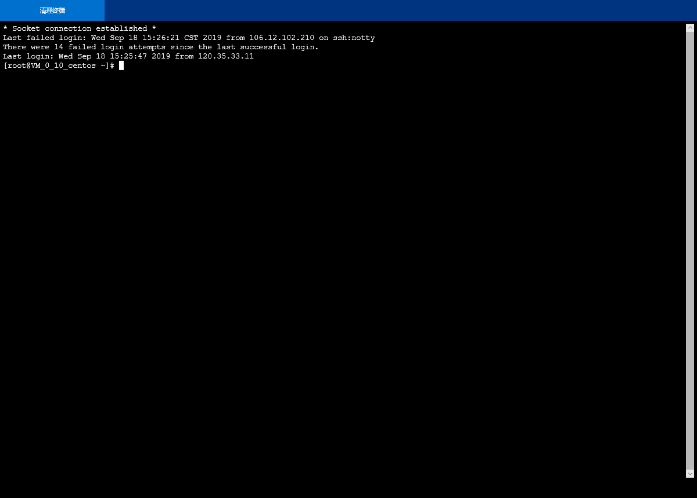

#### 1.3 使用Xshell登录腾讯云实例

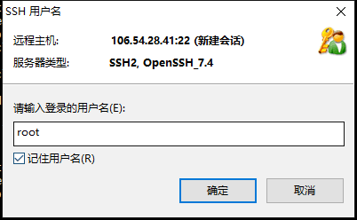

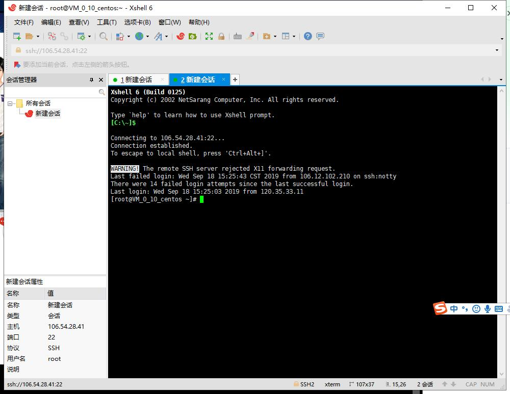

### 二.注册GitHub项目并在本地同步

#### 2.1 注册GitHub账号

##### [github网站]([https://github.com](https://github.com/))

#### 2.2 在GitHub上创建云计算项目并同步到本地

##### 2.2.1 安装git

[git下载网址](https://git-scm.com/downloads)

##### 2.2.2 创建SSH Key

使用 Git Bash进行命令行操作。

验证是否存在ssh keys

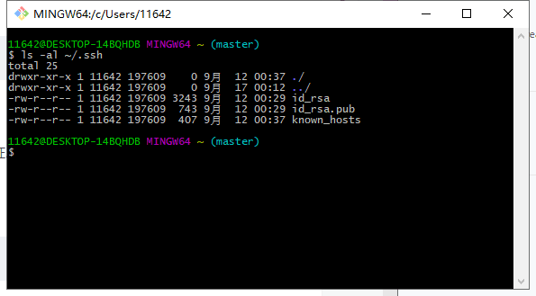

如果以下四个都没有

+ id_dsa.pub
+ id_ecdsa.pub
+ id_ed25519.pub
+ id_rsa.pub

则新建一个ssh密钥：

> ssh-keygen -t rsa -b 4096 -C “your_email@example.com”

然后会让你输入想要保存的ssh key文件名，这里建议不输入如何文件名，直接回车。

然后在C:\Users\UserName上寻找.SSH文件夹，文件夹中id_rsa代表私钥id_rsa.pub代表公钥。

将id_rsa.pub的内容复制到github的setting里的SSH and  GPG keys 中

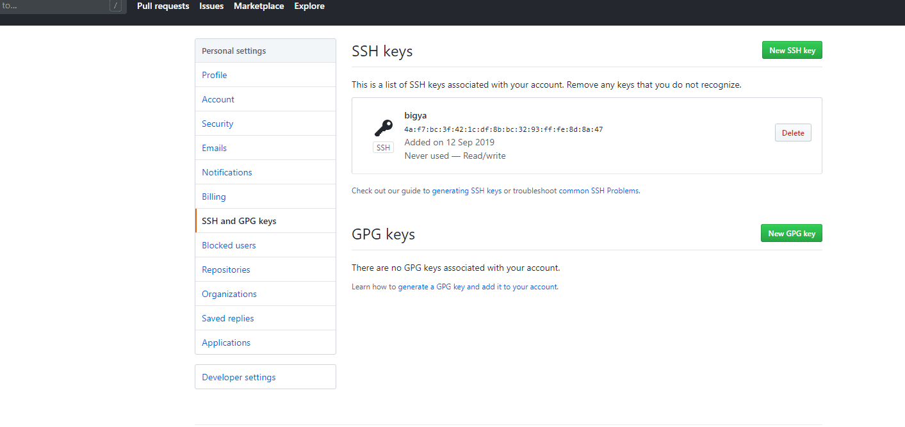

然后测试SSH Key是否配置成功：

> ssh -T git@github.com

在continue的时候，选择yes，即可显示认证成功

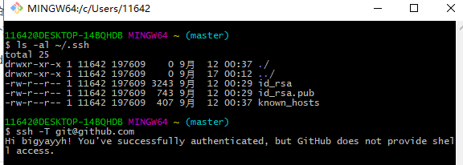

##### 2.2.3 配置GitHub的用户名和邮箱

配置用户名

> git config --global user.name “你的github用户名”

配置邮箱

> git config --global user.email "你的github邮箱"

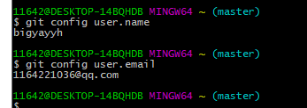

##### 2.2.4 创建github项目

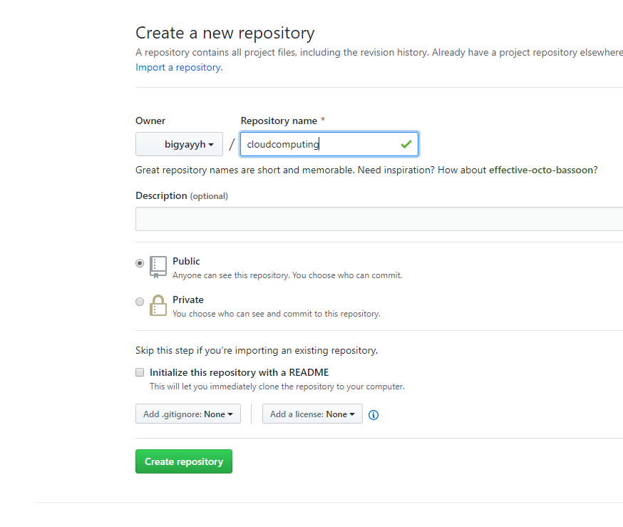

##### 2.2.5 创建本地代码仓库

在本地创建一个文件夹用于同步github的项目，然后打开git bash定位到该文件夹 

1.初始化本地文件夹作为一个git仓库：

> git init

2.拷贝github网站中的项目网址：

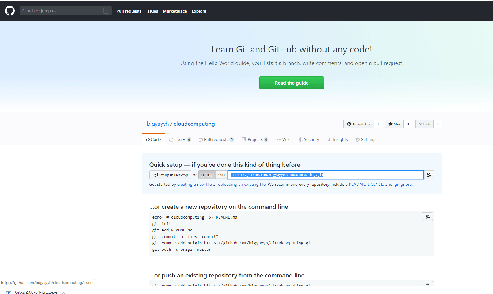

3.添加远程代码仓库的url：

> git remote add origin “你的github网站中的项目网址”

查看是否添加成功：

> git remote -v

4.从远程代码仓库拉去数据：

> git pull origin master

5.新建README文档：

> touch README.md

6.添加文件夹中的所有文件：

> git add .

7.提交文件：

> git commit -m “first commit”

8.推送到远程服务器：

> git push -u origin master

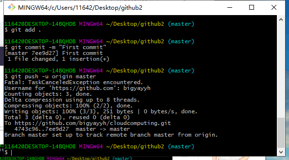

### 三.本地安装VMware Workstation和CentOS操作系统

#### 3.1 自行安装vmware workstation

[VMware workstation15下载地址](https://www.vmware.com/cn/products/workstation-player/workstation-player-evaluation.html)

#### 3.2 在VMware Workstation安装CentOS

+ 打开vmware workstation15，创建新的虚拟机

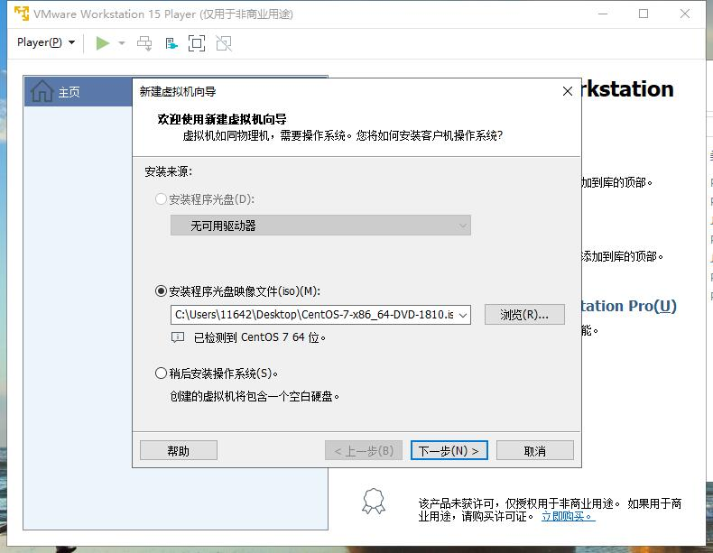

+ 设置磁盘大小

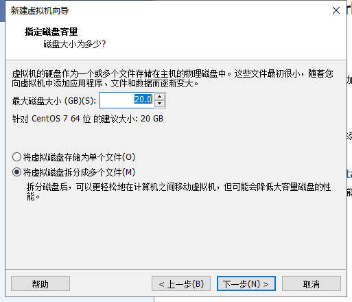

+ 点击自定义硬件后点击处理器，勾选虚拟化 Intel VT-x/EPT那个选项

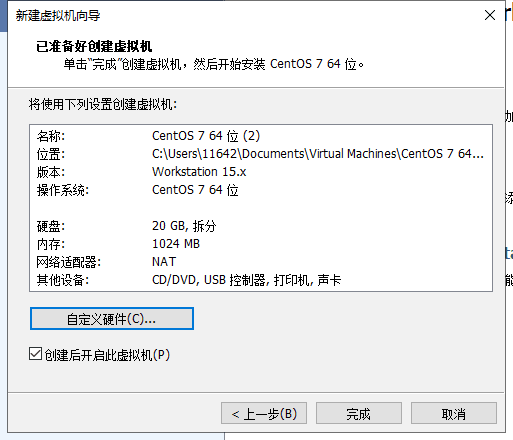

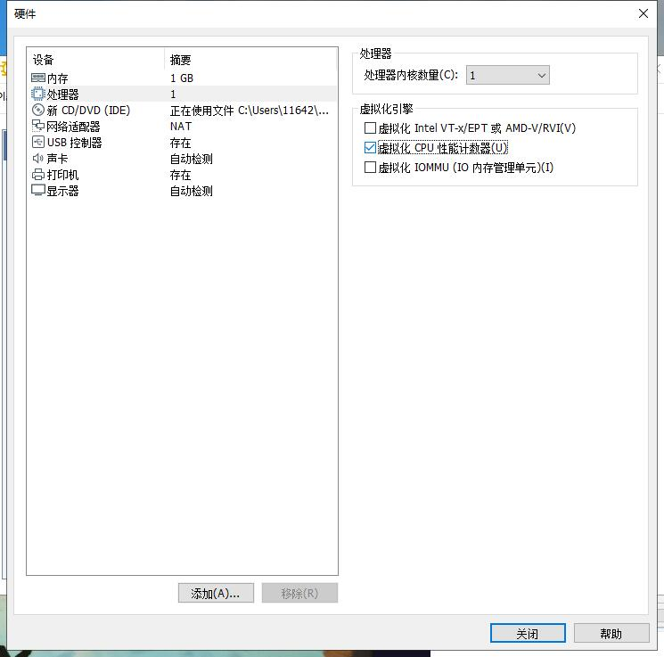

然后等待安装，完成后登录CentOS

