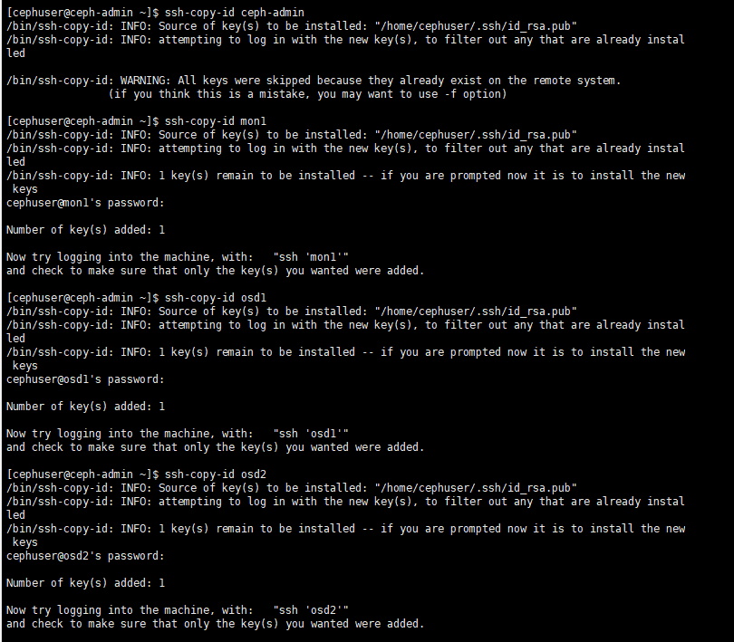

虚拟机安装4个centos7，最小安装，只有命令函界面

进入系统后用ip add查询系统ip，然后用xshell连接

##### **给所有节点**

添加用户并配置sudo权限

然后安装配置ntp服务

禁用selinux

防火墙设置

《1》主控结点防火墙

《2》mon1结点防火墙

《3》普通结点防火墙

#### 准备工作

主控结点添加如下配置

设置免密登录ssh并添加配置

使用ssh-copy-id命令将ssh密钥添加到所有结点

测试连接其他各个结点

ceph-deploy安装

在每个结点下方执行以下内容

添加ceph仓库

sudo vi /etc/yum.repos.d/ceph.repo

在mon1结点执行，修改主机名为mon1

为osd守护进程创建目录

检查集群状态

