# Docker基础实验

## 1 安装Docker

*更新应用程序数据库*

```
yum check-update
```

*添加Docker官方仓库，安装最新Docker*

```
curl -fsSL https://get.docker.com/ | sh
```

*启动Docker*

```
systemctl start docker
```

*设置Docker自启动*

```
systemctl enable docker
```

*查看Docker 版本信息*

```
docker version
```

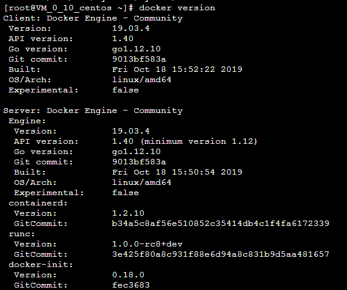

## 2 拉取CentOS镜像，并基于该镜像运行容器，在容器实例上完成WordPress的安装，并推送到Docker Hub

### 2.1 拉取CentOS镜像，并基于该镜像运行容器

*拉取 Centos 7*

```
docker pull centos:7
```

*拉取完毕后查看镜像*

```
docker images
```

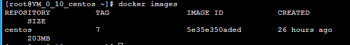

*运行Docker容器*

```
docker run -d -it --privileged --name wordpress -p 8888:80 -d centos:7 /usr/sbin/init
```

*查看已启动的容器*

```
docker ps
```

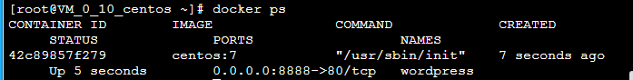

进入容器前台（容器id可以只写前几位）

```
docker exec -it 42c /bin/bash
```

### 2.2在容器实例上完成WordPress的安装，并推送到Docker Hub

##### 2.2.1 安装apache web服务器

*连接ssh后使用yum安装*

```
yum install httpd
```

*安装完成后，启动Apache Web服务器*

```
systemctl start httpd.service
```

*设置开机自启*

```
systemctl enable httpd.service
```

*访问服务器公网IP,出现下图代表Apache安装成功*

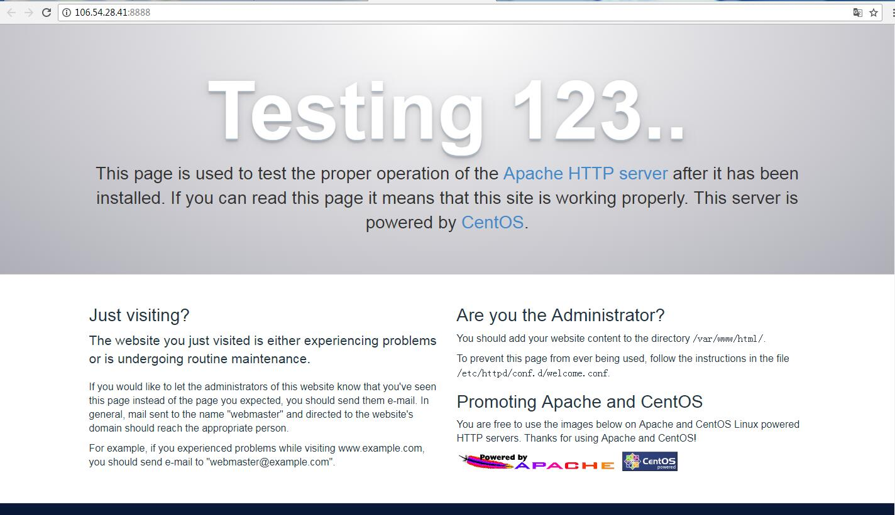

##### 2.2.2 安装MySQL

*安装mariadb*

```
yum install mariadb-server mariadb
```

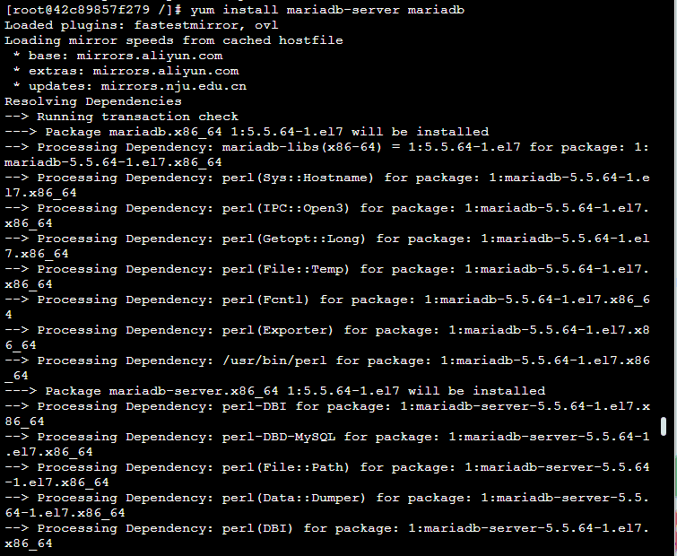

启动mariadb*

```
systemctl start mariadb
```

*设置mysql的root密码*

```
mysql_secure_installation
```

###### ***初始密码为空，提示输入正确密码，直接回车，再设置密码，其他选择Y***

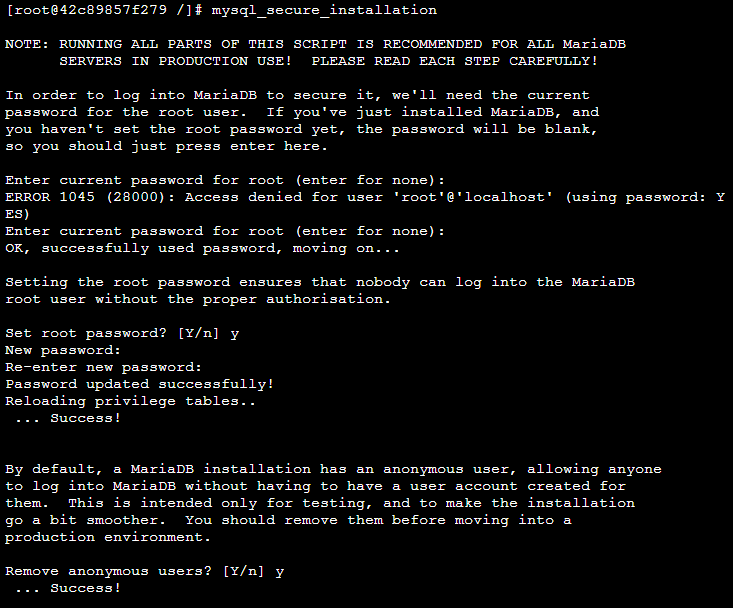

*设置mariadb开机自启*

```
systemctl enable mariadb.service
```

##### 2.2.3 安装php

```
yum install epel-release yum-utils
yum install http://rpms.remirepo.net/enterprise/remi-release-7.rpm
```

*因为WordPress需要php5.6以上版本的支持，我们更新到7.2版本仓库*

```
yum-config-manager --enable remi-php72
```

*安装PHP以及php-mysql*

```
yum install php php-mysql
```

*查看安装的php版本*

```
php -v
```

*重启Apache服务器以支持PHP*

```
systemctl restart httpd.service
```

*为了更好的运行PHP，需要启动PHP附加模块*

```
yum install php-fpm php-gd
```

*重启Apache服务*

```
service httpd restart
```

##### 2.2.4 安装wordpress以及完成相关配置

*登录数据库*

```
mysql -u root -p
```

*为WordPress创建一个新的数据库*

```
CREATE DATABASE 数据库名 ;
```

*进入刚创建的数据库*

```
use 数据库名 ;
```

*为WordPress创建一个独立的MySQL用户并授权给数据库访问权限*

```
CREATE USER 用户名@localhost IDENTIFIED BY '密码';
GRANT ALL PRIVILEGES ON 数据库名.* TO 用户名@localhost IDENTIFIED BY '密码';
```

*刷新MySQL的权限*

```
FLUSH PRIVILEGES;
```

*安装WordPress*

```
cd ~
wget https://raw.githubusercontent.com/helang0616/gitalk/master/wordpress-5.2.4.tar.gz
tar xzvf wordpress-5.2.4.tar.gz
sudo rsync -avP ~/wordpress/ /var/www/html/
mkdir /var/www/html/wp-content/uploads
sudo chown -R apache:apache /var/www/
```

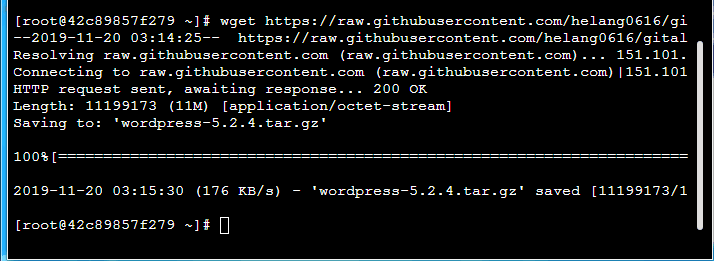


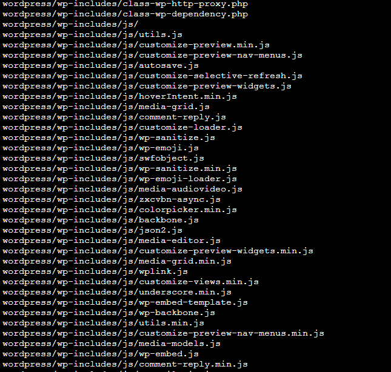


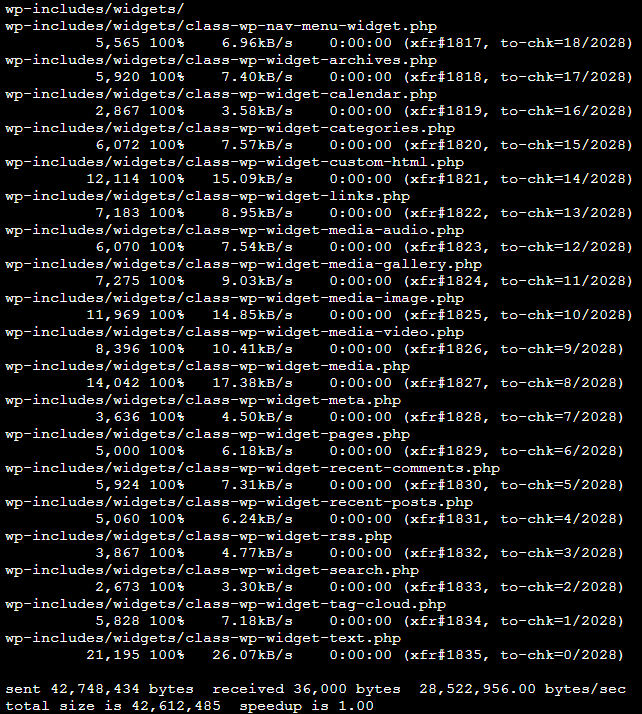


*接下来访问服务器公网ip加端口就能进入wordpress的安装界面*

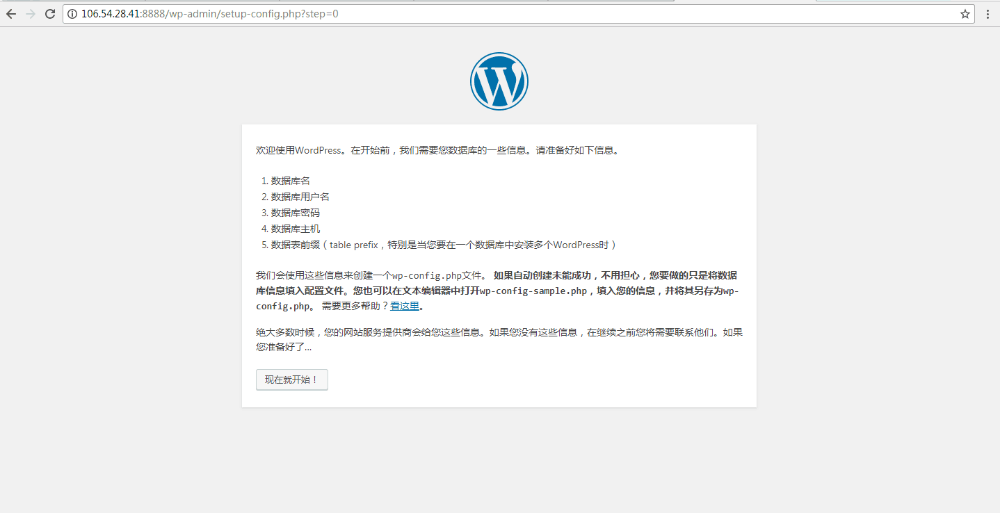

*点击继续，填写先前创建的数据库名，用户名及密码*

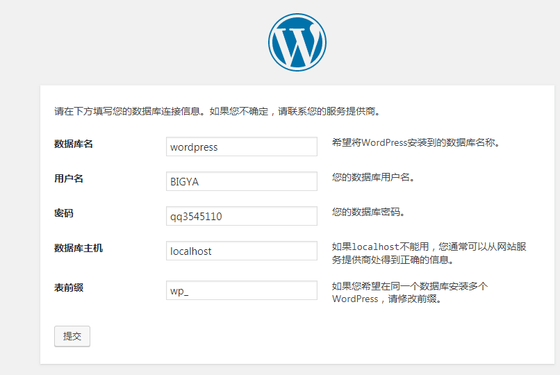

*提交后点击安装，填写以下信息*

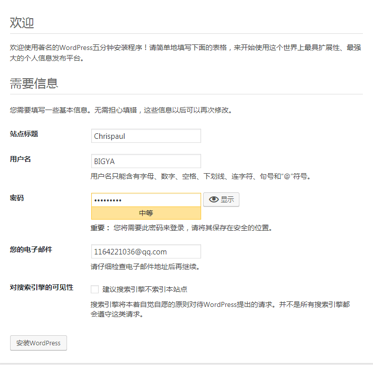

*安装完成后即可进入WordPress编辑自己的博客了*

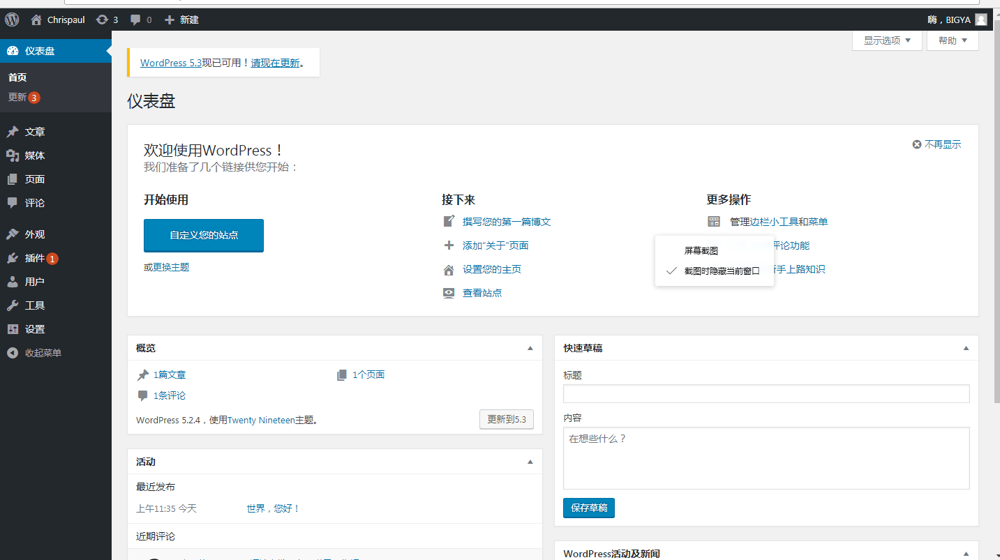

##### 2.2.5 推送带有wordpress的镜像

*前往docker hub注册账号*

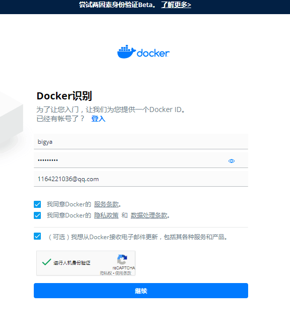

*将容器生成镜像*

```
docker commit -a "Docker用户名" -m "提交描述" 容器id 镜像名:tag标签
```

*登录Docker*

```
docker login
```

*推送镜像*

```
docker push 镜像名:tag标签
```

*登录Docker网页查看仓库*

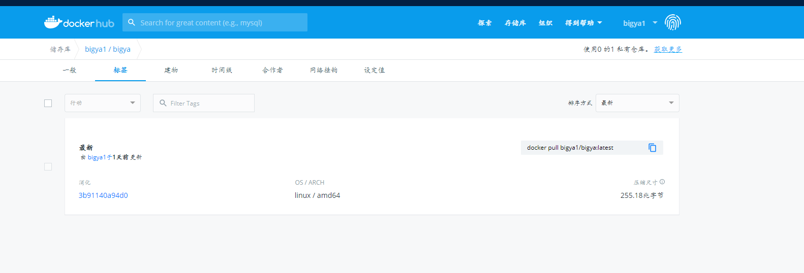

## 3 利用Dockerfile创建一个完成WordPress安装的镜像

利用Dockerfile文件创建包含WordPress的镜像

```
docker build -t wordpress .
```

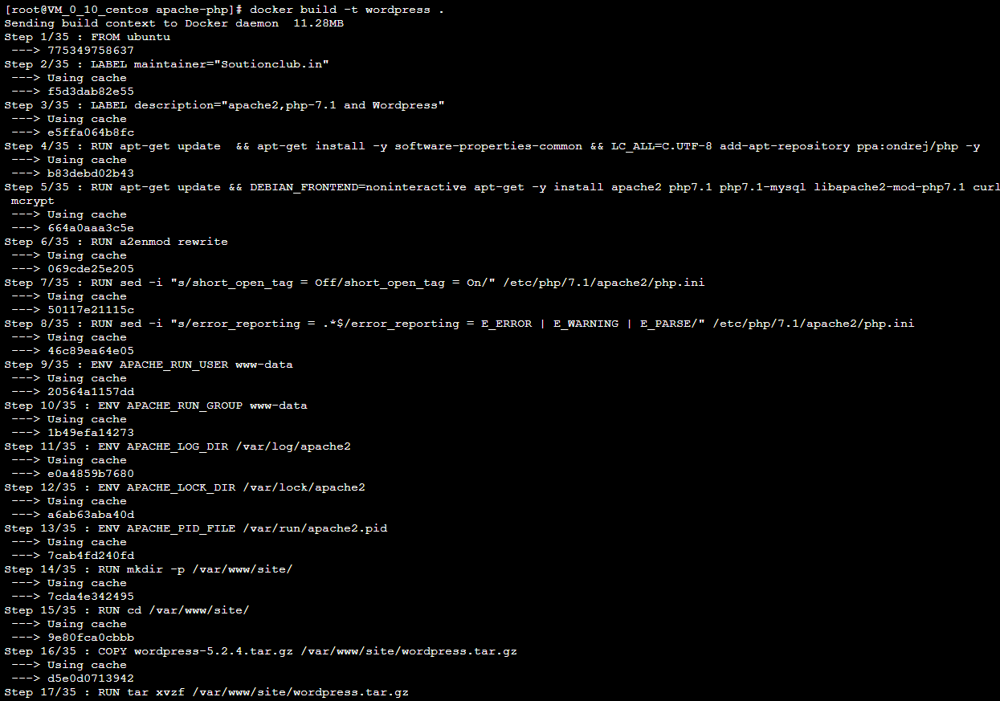

```
docker run -itd -p 8000:80 --name wordpress wordpress
```

网页输入公网ip加端口进入wordpress的配置

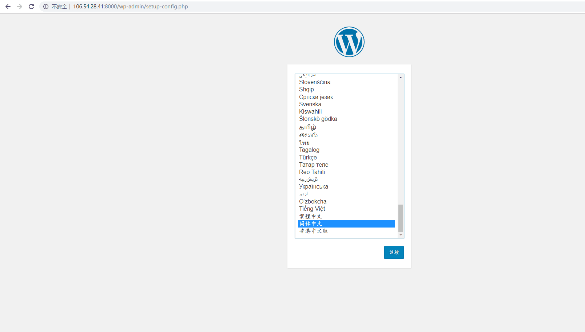

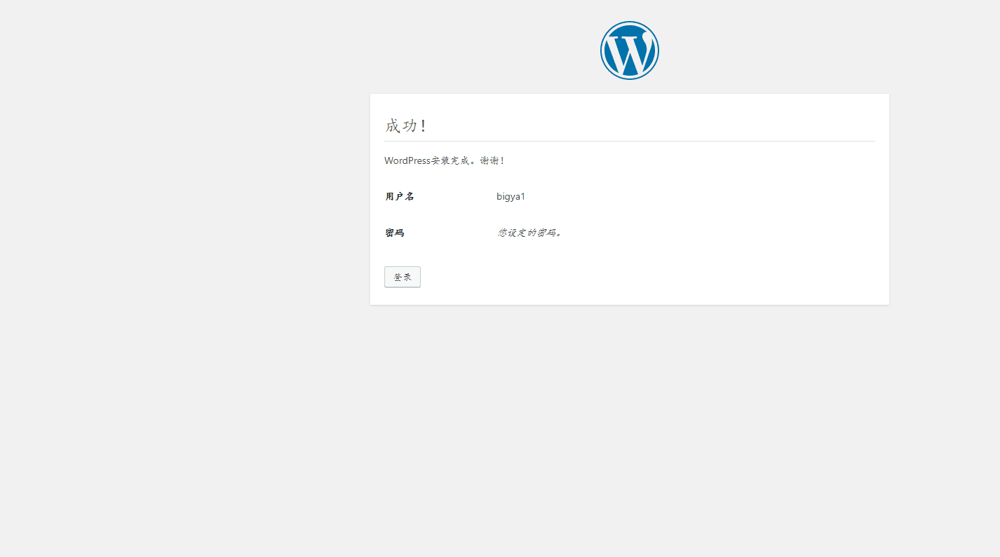

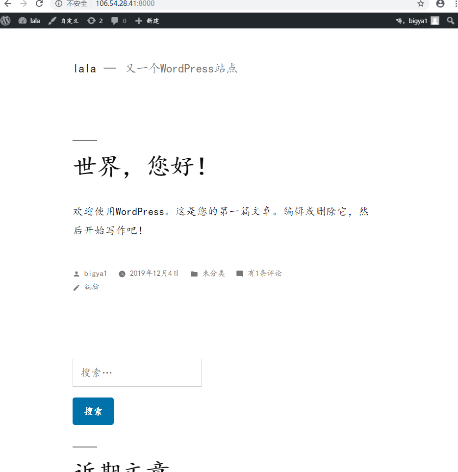

