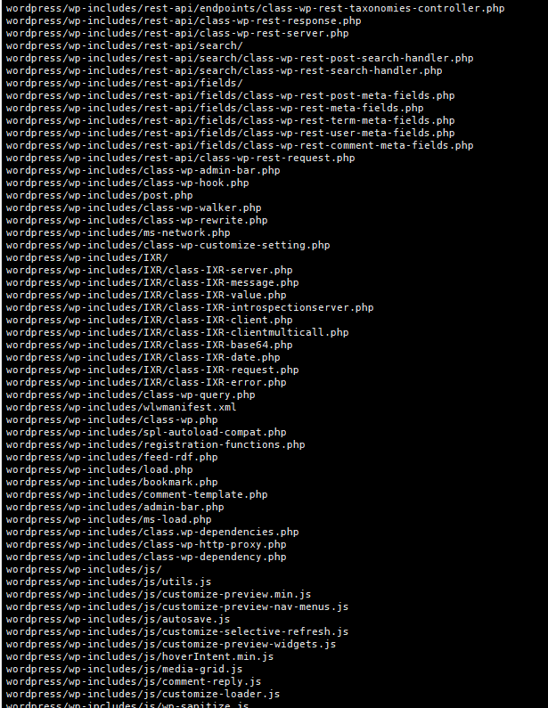
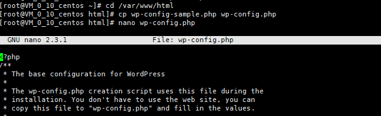

# 腾讯云CentOS 7上搭建WordPress

## 1.安装Apache web服务器

使用yum工具安装：

启动Apache web服务器

测试apache服务器是否成功运行

## 2.安装MySQL

安装mariaDB

启动mariadb

运行简单的安全脚本以移除潜在的安全风险，启动交互脚本

设置相应的root访问密码以及相关的设置

置开机启动MariaDB

## 3.安装PHP

启用两个仓库

启用PHP 7.2 Remi仓库

安装PHP以及php-mysql

查看安装的php版本

重启Apache服务器以支持PHP

安装PHP模块

重启Apache服务

## 4.测试PHP

利用一个简单的信息显示页面（info.php）测试PHP。创建info.php并将其置于Web服务的根目录（/var/www/html/）

该命令使用vim在/var/www/html/处创建一个空白文件info.php，我们添加如下内容：

完成之后，使用刚才获取的cvm的IP地址，在你的本地主机的浏览器中输入

## 5.安装wordpress以及完成相关配置

### （1）为wordpress创建一个mysql数据库

以root用户登录MySQL数据库

为WordPress创建一个新的数据库

为WordPress创建一个独立的MySQL用户

授权给wordpressuser用户访问数据库的权限

刷新MySQL的权限

### （2）安装wordpress

下载WordPress至当前用户的主目录

解压wordpress

将wordpress文件夹同步到apache服务器的根目录下

在Apache服务器目录下为wordpress创建一个文件夹来保存上传的文件并对Apache服务器的目录以及wordpress相关文件夹设置访问权限

### （3）配置wordpress

大多数的WordPress配置可以通过其Web页面完成，但首先通过命令行连接WordPress和MySQL。
定位到wordpress所在文件夹，然后，通过nano超简单文本编辑器来修改配置

更改数据库名，数据库用户，和数据库密码为之前为WordPress创建的数据库的相关信息

### （4）通过web界面进一步配置wordpress

在浏览器中输入你的IP地址或者域名就会出现如下界面，注册登录侯

然后进入wordpress的控制面板就可以设计你的wordpress界面了

